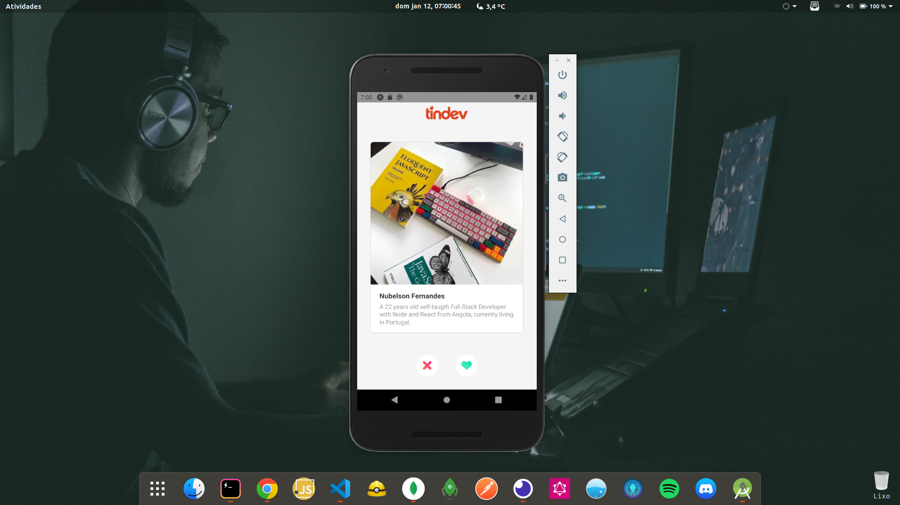

# Tindev (Mobile w/ React Native)



This is the frontend mobile version of Tindev. Allows Developers to login by typing in the github username. This redirects them to the application's homepage where they can see all developers that the user has not yet liked or dislike.

## Getting Started

These instructions will get you a copy of the project up and running on your local machine (Real mobile device or simulator) for development and testing purposes. Feel free to deploy if you want.

### Prerequisites

You will need the [backend](https://github.com/nubelsondev/tindev-backend) to be running so that you can connect both sides of the Application putting the `BACKEND_URL` in the `.env` file.

```javascript
BACKEND_URL = urlBackend
```

### Installation

Clone the repository and run

```javascript
// With NPM
$ npm install
$ npm run start

// With Yarn
$ yarn install
$ yarn start
```

## Built With

-   [React Native](https://facebook.github.io/react-native/)
-   [React-Navigation](https://reactnavigation.org/)
-   [Formik](https://jaredpalmer.com/formik)
-   [Axios](https://github.com/axios/axios)
-   [Expo](https://expo.io/)

## Contributing

Please feel free to send pull request if you want to contribute!

## Authors

-Nubelson - _Development_ - [nubelsondev](https://github.com/nubelsondev)
